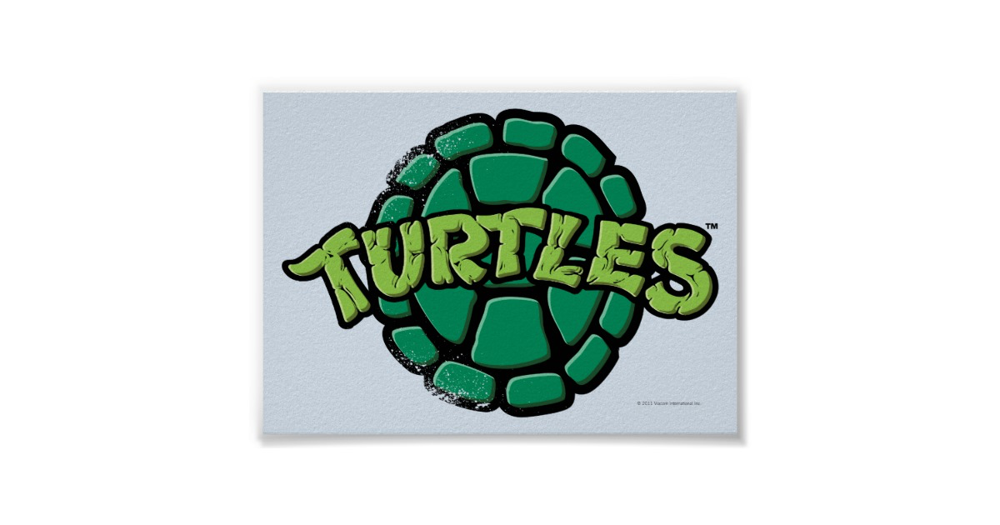

  

 

<h1>
Turtle Shell</h1>

# TSH
Turtle Shell also known as the shell is a simple command line prompt that takes the most basics of commands that are present in the bash shell and runs them. This shell was built as a project for Holberton School.

`the shell` works like the bash and other basic shells.

The shell works by being compiled using GCC 4.8.5 compiler or later versions. The shell can compile using `gcc 4.8.4 -Wall -Werror -Wextra -pedantic *.c -o shell`.

## Example of how to launch the shell after compiling:
`./shell`

* Output: prompt to terminal: `$ `

## Syntax
The shell works by using commands given by the user input. The shell commands take in the following syntax: `command name {arguments}`. The shell executes a command after it is written by user using the command followed by the arguments.

`ls`
The above example takes in a command by the user and will list all files and directories in current working directory. 
For each operand that names a file of a type other than directory, ls displays its name as well as any requested, associated information.  For each operand that names a file of type directory, ls displays the names of files contained within that directory, as well as any requested, associated information.
If no operands are given, the contents of the current directory are displayed.  If more than one operand is given, non-directory operands are displayed first; directory and non-directory operands are sorted separately and in lexicographical order.

For more information on ls, you can use the `man` command which will show a manual of the given command or any command you wish to know more information on. It contains system calls, libraries and other important files.

The shell also contains two builtins which are commands that are within the shell itself. The two builtins are `exit` and `env`. You can also use `help` command to know which builtins are provided by the shell. The `help` command works similarly to the manual where it provides further detail or information on given builtin.

### Compilation
All files will be compiled with the following: `$ gcc -Wall -Werror -Wextra -pedantic *.c`

### List of useful commands
* `mv` - helps to move one file into another file
* `cat` - prints and concatenates files to the standard output
* `pwd` - given you the current working directory
* `less` - will let you go backward and forward in the files
* `cp` -copies a file into another file
* `grep` - helps to search for a file in a specific pattern
* `ls` - will list all files and directories in current working directory

### Builtins
There are two builtins programmed into the shell. Below is a description and use for each builtin.

* `env` - The env command is a command that tells the shell program to display all of the environment variables with their values. It is a    way to access those values through the shell.

* `exit` - If you wish to exit out of the shell the user can use the builtin `exit`.

### Exiting commands and the shell
To exit out of a command or process the user can use `ctrl c`. `Control c` stops a process and causes it to abort.
The user can also utilize the command `ctrl D` which will just exit. When the command `ctrl D` is used an exit status of 0 is given. Using exit, you can input its exit status or it is defaulted to the status of the last command executed.

## Files
* `README.md` : Current file, contains information about this project
* `holberton.h` : Header file, contains all prototypes for funcitons used, as well as libriaries

### Comments

### Authors
* Wendy Segura - https://github.com/wendysegura
* Larry Madeo - https://github.com/Hillmonkey
